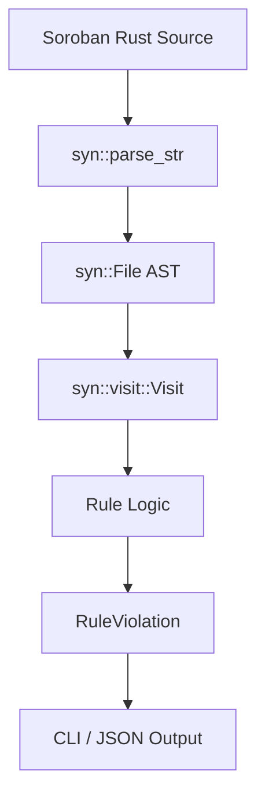

# Detector Cookbook: Writing Custom Static Analysis Rules

Detectors are the growth engine of Sanctifier. They analyze Rust and Soroban source code to locate potential vulnerabilities, logic bugs, or code hygiene issues before deployment.

This cookbook is a hands-on guide that walks you through writing three detectors of increasing complexity — from a trivial syntactic check to a basic data-flow tracker.

---

## The Detector Pipeline

Sanctifier processes target contracts through a standard compiler-like pipeline:



1. **Source**: The target Rust contract's file content is read as a raw string.
2. **Parse**: `syn::parse_str::<syn::File>(&source)` parses the source code into an Abstract Syntax Tree (AST).
3. **Visitor**: We traverse the AST using `syn::visit::Visit` to inspect functions, macros, expressions, and structures.
4. **Finding Emission**: If a rule violates security or style checks, we construct a `RuleViolation` specifying the rule name, severity, location, suggestions, and optionally a patch.
5. **Reporting**: Findings are formatted and reported to the CLI, JSON output, or webhooks.

---

## Example 1 (Trivial): Banned Macro Detector (`no_todo_macro`)

This syntactic detector flags any use of the standard library's `todo!` macro. It is simple because it does not track state across nodes; it simply checks each macro invocation.

### 1. Register the Finding Code

Add the new error code to `tooling/sanctifier-core/src/finding_codes.rs`:

```rust
// In finding_codes.rs
pub const BANNED_MACRO: &str = "S017";

// Add to all_finding_codes() vec:
FindingCode {
    code: BANNED_MACRO,
    category: "code_hygiene",
    description: "Use of banned macro (e.g., todo!) which causes runtime aborts",
}
```

### 2. Implement the Rule

Create a new file `tooling/sanctifier-core/src/rules/no_todo_macro.rs`:

```rust
use crate::rules::{Rule, RuleViolation, Severity};
use syn::visit::{self, Visit};
use syn::{parse_str, File, Macro};

pub struct NoTodoMacroRule;

impl NoTodoMacroRule {
    pub fn new() -> Self {
        Self
    }
}

impl Default for NoTodoMacroRule {
    fn default() -> Self {
        Self::new()
    }
}

impl Rule for NoTodoMacroRule {
    fn name(&self) -> &str {
        "no_todo_macro"
    }

    fn description(&self) -> &str {
        "Detects use of the todo! macro which causes runtime aborts"
    }

    fn check(&self, source: &str) -> Vec<RuleViolation> {
        let file = match parse_str::<File>(source) {
            Ok(f) => f,
            Err(_) => return vec![],
        };

        struct TodoVisitor {
            violations: Vec<RuleViolation>,
            rule_name: String,
        }

        impl<'ast> Visit<'ast> for TodoVisitor {
            fn visit_macro(&mut self, mac: &'ast Macro) {
                if mac.path.is_ident("todo") {
                    let span = mac.path.segments[0].ident.span();
                    let line = span.start().line;
                    let col = span.start().column;
                    
                    self.violations.push(
                        RuleViolation::new(
                            &self.rule_name,
                            Severity::Warning,
                            "Use of 'todo!' macro found".to_string(),
                            format!("{}:{}", line, col),
                        )
                        .with_suggestion("Implement the missing logic instead of todo!".to_string())
                    );
                }
                visit::visit_macro(self, mac);
            }
        }

        let mut visitor = TodoVisitor {
            violations: Vec::new(),
            rule_name: self.name().to_string(),
        };
        visitor.visit_file(&file);
        visitor.violations
    }

    fn as_any(&self) -> &dyn std::any::Any {
        self
    }
}
```

### 3. Fixture (`tests/fixtures/detectors/no_todo_macro.rs`)

```rust
pub fn process_payment(amount: u32) {
    if amount == 0 {
        todo!(); // Should flag
    }
    // Clean path
    let _x = amount + 1;
}
```

### 4. Insta Snapshot (`tests/snapshots/detector_snapshots__no_todo_macro.snap`)

```yaml
---
source: tooling/sanctifier-core/tests/detector_snapshots.rs
expression: findings
---
- rule_name: no_todo_macro
  severity: Warning
  message: "Use of 'todo!' macro found"
  location: "3:8"
  suggestion: Implement the missing logic instead of todo!
```

---

## Example 2 (Medium): State Write Without Event (`state_write_no_event`)

This rule flags public contract functions that mutate storage (using `set`, `update`, or `remove`) but fail to emit a corresponding event (using `publish`).

### 1. Register the Finding Code

```rust
pub const STATE_WRITE_NO_EVENT: &str = "S018";

// Add to all_finding_codes() vec:
FindingCode {
    code: STATE_WRITE_NO_EVENT,
    category: "events",
    description: "Function modifies contract state but does not emit a corresponding event",
}
```

### 2. Implement the Rule

Create `tooling/sanctifier-core/src/rules/state_write_no_event.rs`:

```rust
use crate::rules::{Rule, RuleViolation, Severity};
use syn::visit::{self, Visit};
use syn::{parse_str, File, ImplItemFn, ExprMethodCall};

pub struct StateWriteNoEventRule;

impl StateWriteNoEventRule {
    pub fn new() -> Self {
        Self
    }
}

impl Default for StateWriteNoEventRule {
    fn default() -> Self {
        Self::new()
    }
}

impl Rule for StateWriteNoEventRule {
    fn name(&self) -> &str {
        "state_write_no_event"
    }

    fn description(&self) -> &str {
        "Detects state mutations that do not emit corresponding events"
    }

    fn check(&self, source: &str) -> Vec<RuleViolation> {
        let file = match parse_str::<File>(source) {
            Ok(f) => f,
            Err(_) => return vec![],
        };

        struct EventVisitor {
            violations: Vec<RuleViolation>,
            rule_name: String,
            has_write: bool,
            has_event: bool,
        }

        impl<'ast> Visit<'ast> for EventVisitor {
            fn visit_impl_item_fn(&mut self, node: &'ast ImplItemFn) {
                // Reset flags for the current function
                self.has_write = false;
                self.has_event = false;

                // Traverse function body
                visit::visit_impl_item_fn(self, node);

                // If there's a write but no event emitted
                if self.has_write && !self.has_event {
                    let span = node.sig.ident.span();
                    let line = span.start().line;
                    let col = span.start().column;
                    
                    self.violations.push(
                        RuleViolation::new(
                            &self.rule_name,
                            Severity::Warning,
                            format!("Function '{}' writes to storage but does not emit an event", node.sig.ident),
                            format!("{}:{}", line, col),
                        )
                        .with_suggestion("Emit an event using env.events().publish(...) after mutating state".to_string())
                    );
                }
            }

            fn visit_expr_method_call(&mut self, node: &'ast ExprMethodCall) {
                let method = node.method.to_string();
                if method == "set" || method == "update" || method == "remove" {
                    self.has_write = true;
                }
                if method == "publish" {
                    self.has_event = true;
                }
                visit::visit_expr_method_call(self, node);
            }
        }

        let mut visitor = EventVisitor {
            violations: Vec::new(),
            rule_name: self.name().to_string(),
            has_write: false,
            has_event: false,
        };
        visitor.visit_file(&file);
        visitor.violations
    }

    fn as_any(&self) -> &dyn std::any::Any {
        self
    }
}
```

### 3. Fixture (`tests/fixtures/detectors/state_write_no_event.rs`)

```rust
impl Contract {
    pub fn update_balance(env: Env, user: Address, amount: i128) {
        env.storage().instance().set(&user, &amount); // Modifies state, no event
    }

    pub fn update_balance_good(env: Env, user: Address, amount: i128) {
        env.storage().instance().set(&user, &amount);
        env.events().publish((symbol_short!("balance"), user), amount); // Correct
    }
}
```

### 4. Insta Snapshot (`tests/snapshots/detector_snapshots__state_write_no_event.snap`)

```yaml
---
source: tooling/sanctifier-core/tests/detector_snapshots.rs
expression: findings
---
- rule_name: state_write_no_event
  severity: Warning
  message: "Function 'update_balance' writes to storage but does not emit an event"
  location: "2:11"
  suggestion: Emit an event using env.events().publish(...) after mutating state
```

---

## Example 3 (Data-Flow): Track Unvalidated Argument to Storage Sink (`argument_to_sink`)

This detector tracks whether function arguments are written directly into a storage key without first calling `.require_auth()` on that argument. This is a simplified data-flow check that tracks variable identifiers from the signature definition into storage sinks.

### 1. Register the Finding Code

```rust
pub const ARGUMENT_TO_SINK: &str = "S019";

// Add to all_finding_codes() vec:
FindingCode {
    code: ARGUMENT_TO_SINK,
    category: "authentication",
    description: "Function argument is written to storage without corresponding require_auth()",
}
```

### 2. Implement the Rule

Create `tooling/sanctifier-core/src/rules/argument_to_sink.rs`:

```rust
use crate::rules::{Rule, RuleViolation, Severity};
use syn::visit::{self, Visit};
use syn::{parse_str, File, ImplItemFn, Expr, Pat, FnArg};

pub struct ArgumentToSinkRule;

impl ArgumentToSinkRule {
    pub fn new() -> Self {
        Self
    }
}

impl Default for ArgumentToSinkRule {
    fn default() -> Self {
        Self::new()
    }
}

impl Rule for ArgumentToSinkRule {
    fn name(&self) -> &str {
        "argument_to_sink"
    }

    fn description(&self) -> &str {
        "Tracks unvalidated function arguments flowing into storage write sinks"
    }

    fn check(&self, source: &str) -> Vec<RuleViolation> {
        let file = match parse_str::<File>(source) {
            Ok(f) => f,
            Err(_) => return vec![],
        };

        struct DataFlowVisitor {
            violations: Vec<RuleViolation>,
            rule_name: String,
            current_params: Vec<String>,
            validated_params: Vec<String>,
        }

        impl<'ast> Visit<'ast> for DataFlowVisitor {
            fn visit_impl_item_fn(&mut self, node: &'ast ImplItemFn) {
                self.current_params.clear();
                self.validated_params.clear();

                // Collect function parameters
                for arg in &node.sig.inputs {
                    if let FnArg::Typed(pat_type) = arg {
                        if let Pat::Ident(pat_ident) = &*pat_type.pat {
                            self.current_params.push(pat_ident.ident.to_string());
                        }
                    }
                }

                // Walk the function body to find validations and sinks
                visit::visit_impl_item_fn(self, node);
            }

            fn visit_expr(&mut self, expr: &'ast Expr) {
                // 1. Detect validation guard (e.g., `user.require_auth()`)
                if let Expr::MethodCall(m) = expr {
                    if m.method == "require_auth" {
                        if let Expr::Path(p) = &*m.receiver {
                            if let Some(ident) = p.path.get_ident() {
                                self.validated_params.push(ident.to_string());
                            }
                        }
                    }
                }

                // 2. Detect sink: storage write using a parameter
                if let Expr::MethodCall(m) = expr {
                    let method = m.method.to_string();
                    if method == "set" || method == "update" {
                        for arg in &m.args {
                            if let Expr::Reference(r) = arg {
                                if let Expr::Path(p) = &*r.expr {
                                    if let Some(ident) = p.path.get_ident() {
                                        let name = ident.to_string();
                                        if self.current_params.contains(&name) && !self.validated_params.contains(&name) {
                                            let span = ident.span();
                                            let line = span.start().line;
                                            let col = span.start().column;
                                            
                                            self.violations.push(
                                                RuleViolation::new(
                                                    &self.rule_name,
                                                    Severity::Error,
                                                    format!("Unvalidated argument '{}' is used as a key in a storage write", name),
                                                    format!("{}:{}", line, col),
                                                )
                                                .with_suggestion(format!("Call '{}.require_auth()' before writing to storage", name))
                                            );
                                        }
                                    }
                                }
                            }
                        }
                    }
                }

                visit::visit_expr(self, expr);
            }
        }

        let mut visitor = DataFlowVisitor {
            violations: Vec::new(),
            rule_name: self.name().to_string(),
            current_params: Vec::new(),
            validated_params: Vec::new(),
        };
        visitor.visit_file(&file);
        visitor.violations
    }

    fn as_any(&self) -> &dyn std::any::Any {
        self
    }
}
```

### 3. Fixture (`tests/fixtures/detectors/argument_to_sink.rs`)

```rust
impl Contract {
    pub fn save_user(env: Env, user: Address) {
        env.storage().instance().set(&user, &true); // Flags: user is unvalidated
    }

    pub fn save_user_secure(env: Env, user: Address) {
        user.require_auth();
        env.storage().instance().set(&user, &true); // Safe
    }
}
```

### 3. Insta Snapshot (`tests/snapshots/detector_snapshots__argument_to_sink.snap`)

```yaml
---
source: tooling/sanctifier-core/tests/detector_snapshots.rs
expression: findings
---
- rule_name: argument_to_sink
  severity: Error
  message: "Unvalidated argument 'user' is used as a key in a storage write"
  location: "3:39"
  suggestion: Call 'user.require_auth()' before writing to storage
```

---

## Future Direction: External Detector Plugins

In the future (referencing Issue #128), Sanctifier will support dynamic external plugins loaded as shared library objects (`.so`/`.dylib`/`.dll`) or running as WebAssembly modules.

Once the `DetectorPlugin` trait is added, it will look like this:

```rust
pub trait DetectorPlugin {
    /// Unique identifier for the plugin
    fn plugin_id(&self) -> &str;
    
    /// List of rules provided by the plugin
    fn rules(&self) -> Vec<Box<dyn Rule>>;
}
```

Dynamic plugins will register their rules into the `RuleRegistry` at runtime via standard hook interfaces.

---

## Checklist for a New Detector

When contributing a new detector, run through this checklist to ensure all assets are updated:

- [ ] **Define Code & Metadata**: Allocate a new code in `finding_codes.rs` (e.g. `S017`), register the description and category.
- [ ] **Implement rule**: Inherit `Rule` trait, write checking logic utilizing `syn::visit::Visit` in `tooling/sanctifier-core/src/rules/`.
- [ ] **Register rule**: Register the new struct inside `RuleRegistry::with_default_rules()` in `tooling/sanctifier-core/src/rules/mod.rs`.
- [ ] **Add Fixture**: Add a sample contract under `tooling/sanctifier-core/tests/fixtures/detectors/<name>.rs` containing both vulnerable and clean code blocks.
- [ ] **Create Test**: Add a `#[test]` function inside `tooling/sanctifier-core/tests/detector_snapshots.rs` referencing your fixture.
- [ ] **Generate Golden Snapshot**: Run `cargo insta test` and `cargo insta accept` to review and commit the new golden `.snap` output.
